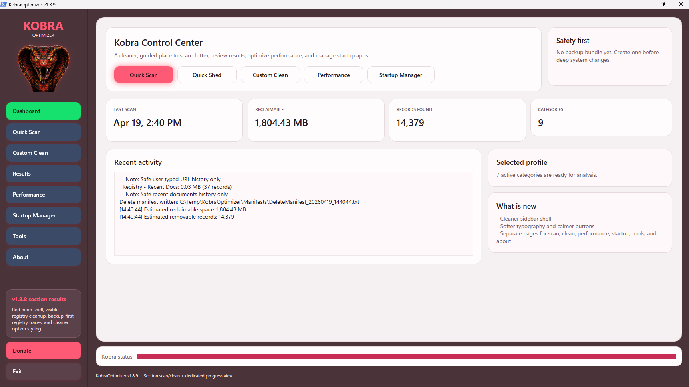
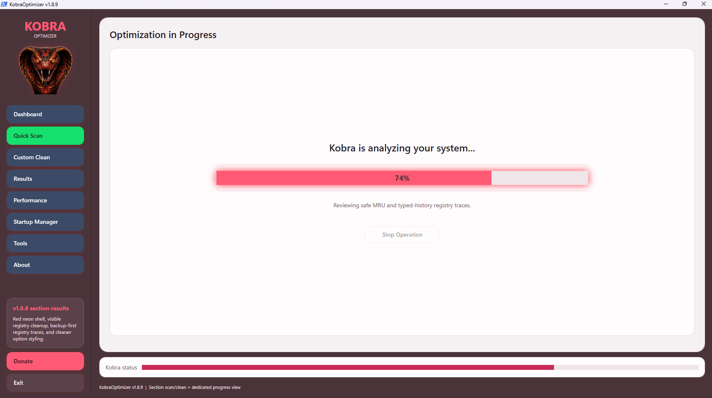
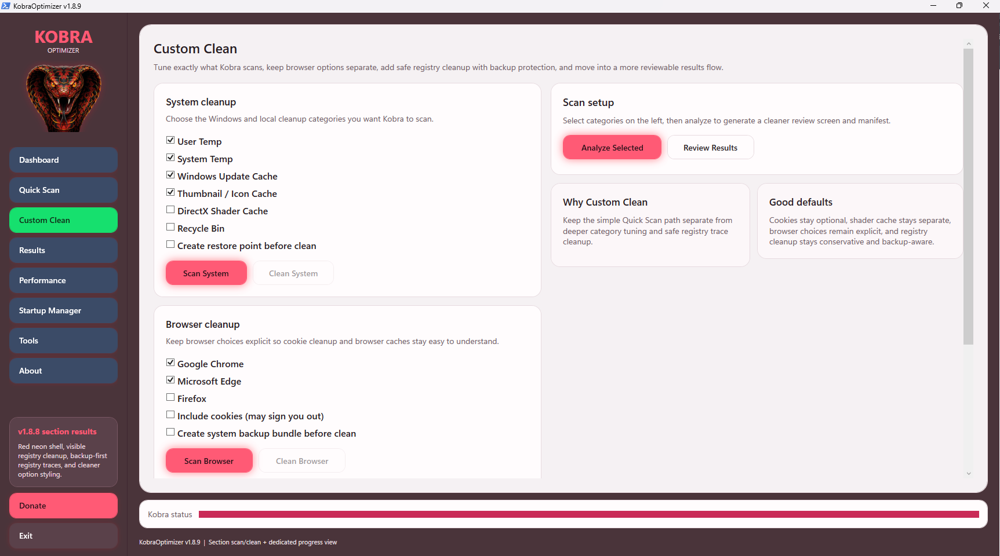
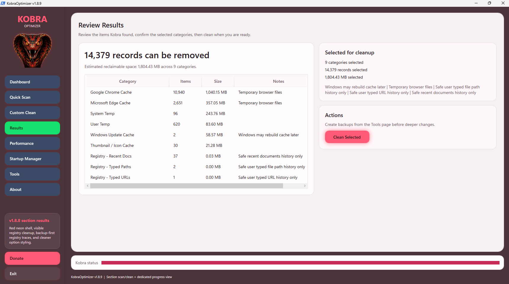
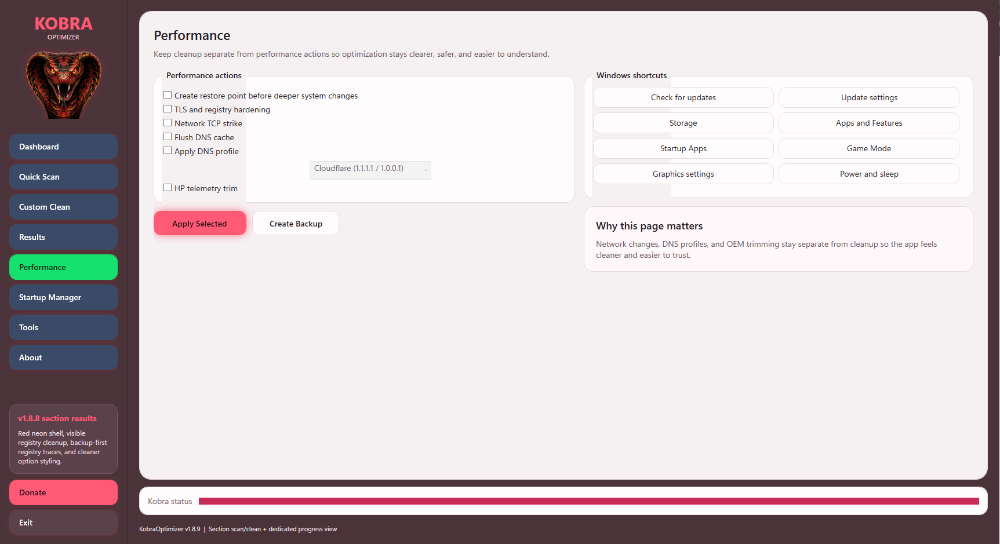

# KobraOptimizer

**Safe, transparent Windows cleanup and optimization utility for Windows 11.**  
KobraOptimizer is a PowerShell + WPF desktop utility focused on **preview-first cleanup**, **section-based control**, **backup-aware maintenance**, and a cleaner user experience than traditional "one-click miracle" PC cleaners.

> **Tagline:** The safe, open-source Windows cleaner that shows you what it will remove — with backups first.

---

## Why KobraOptimizer?

KobraOptimizer was built around a simple idea:

**Users should be able to review what is being scanned, understand what is being cleaned, and protect themselves before higher-risk operations run.**

A lot of Windows cleanup tools feel opaque, overly aggressive, ad-heavy, or too vague about what they actually remove. KobraOptimizer takes a different path:

- **Preview before clean**
- **Dedicated scan and clean actions by section**
- **Backup-aware design**
- **Clear results and progress views**
- **Safer registry approach**
- **No fake “magic speed boost” claims**

KobraOptimizer is designed for people who want a **practical Windows cleanup utility** that feels modern, visual, and controlled.

---

## What KobraOptimizer Does

KobraOptimizer is a **Windows cleanup and maintenance tool** with a modern section-based UI. It helps users:

- scan for removable junk files
- clean temporary system and user clutter
- clean supported browser cache data
- optionally remove selected browser cookies
- preview registry trace cleanup results
- manage startup impact and performance-related areas
- review results before cleanup
- create backups before more sensitive operations

The utility is focused on **Windows 11**, especially users who want a **safe PC cleaner**, **Windows optimizer**, **startup manager**, **browser cache cleaner**, and **registry trace cleanup tool** in one place.

---

## Core Design Principles

### 1. Safety first
KobraOptimizer is built around **scan → review → clean**, not blind one-click deletion.

### 2. Transparency
The app is designed to show:
- what was found
- how much space can be reclaimed
- which section was scanned
- what the user is about to remove

### 3. Section-based control
Users should be able to scan and clean **only the area they care about**, instead of scanning the entire system every time.

### 4. Conservative cleanup
KobraOptimizer is intended to be safer than aggressive “optimizer” tools. For example:
- browser cleaning is designed to preserve bookmarks and saved passwords by default
- registry work is intended to focus on **trace cleanup**, not dangerous “deep registry repair”
- backup options are built into more sensitive sections

### 5. Simplicity
The UI is meant to stay visual, clean, and understandable.

---

## Current Sections

### Dashboard
The Dashboard is the home screen for KobraOptimizer. It is meant to give users a quick overview of the product and their current state.

Typical use:
- start a quick scan
- jump into Custom Clean
- open Performance
- review status visually

### Quick Scan / Scan
Quick Scan is designed for users who want a fast, guided scan experience without manually selecting each cleanup area.

### Custom Clean
Custom Clean is one of the main power-user sections and is currently built around three primary cleanup groups:

#### System
System cleanup targets common junk and clutter areas such as:
- user temp
- system temp
- Windows update cache
- thumbnail/icon cache
- recycle bin
- other reclaimable system clutter where supported

#### Browser
Browser cleanup is designed to target browser junk such as:
- cache
- shader / code cache
- service worker cache areas where supported
- optional cookie cleanup if selected

**Important:** Browser cleanup is intended to **preserve bookmarks and saved passwords by default**. Cookies may sign users out of websites if the cookie option is selected.

#### Registry
Registry cleanup in KobraOptimizer is intended to be **conservative** and focused on **trace cleanup**, not aggressive registry repair.

Examples of registry trace categories discussed for Kobra:
- Run history
- Typed paths
- Typed URLs
- Recent documents traces
- Explorer / search related traces

This is intentionally a safer scope than traditional “registry cleaners.”

### Results
The Results page is where KobraOptimizer becomes more transparent and more useful. It is intended to show:
- what each scan found
- how many items were detected
- estimated reclaimable size
- which section was scanned
- what can be cleaned next

### Progress
KobraOptimizer includes a dedicated progress view so users can clearly see when a scan, cleanup, or backup operation is running.

### Performance Optimizer
Performance is intended to be a practical control center, not a gimmick.

Current or planned focus areas include:
- startup impact
- active apps
- excluded apps
- practical performance suggestions
- section-aware actions

The goal is to help users make informed choices rather than promise fake “turbo boost” claims.

### Tools
The Tools area is intended for utility actions such as:
- backup creation
- startup manager access
- maintenance shortcuts
- future Windows support tools

---

## Safety and Backup Philosophy

KobraOptimizer is not intended to be a reckless “delete everything” cleaner.

### Built-in safety direction
Depending on the section, safety measures may include:
- preview before clean
- results review before action
- system restore point options
- registry backup options
- backup bundle creation
- clear warnings around cookies and other sensitive cleanup actions

### Registry safety
Registry cleanup should always be treated carefully. KobraOptimizer is being positioned around:
- **trace cleanup**
- **backup-first behavior**
- **clear user consent**
- **no exaggerated registry performance claims**

---

## What KobraOptimizer Does **Not** Claim

KobraOptimizer is **not** intended to promise:
- miracle FPS boosts
- magical RAM creation
- deep system repair claims without evidence
- instant “like new PC” transformations

Real benefits from utilities like this usually come from:
- reclaiming storage
- reducing clutter
- cleaning temporary junk
- reducing startup burden
- helping users manage their system more intentionally

That honest positioning is part of the product.

---

## Screenshots

### Dashboard


### Scan / Quick Scan


### Custom Clean


### Results


### Performance


### About


---

## Installation

### Requirements
- Windows 11
- PowerShell 5.1 or later
- Administrative rights recommended for some advanced operations
- project files kept together in the same folder structure

### Typical structure
- `Main.ps1`
- `Kobra_UI.xaml`
- `Modules\`
- `Assets\`
- `Screenshots\`
- `Launch_Kobra.cmd`

### Launch
You can typically launch KobraOptimizer using the included launcher:

```powershell
.\Launch_Kobra.cmd
```

Or directly:

```powershell
powershell.exe -NoProfile -ExecutionPolicy Bypass -File .\Main.ps1
```

---

## Usage

### Recommended flow
1. Open KobraOptimizer
2. Choose the section you want
3. Run **Scan**
4. Review the **Results**
5. Enable backup or restore options where appropriate
6. Run **Clean**

### Good examples
- Scan only **Browser** if you only want cache cleanup
- Scan only **Registry** if you want to review trace cleanup first
- Use **System** if you want to reclaim general junk space
- Review **Results** before cleaning

---

## How KobraOptimizer Differs from Typical PC Cleaners

KobraOptimizer is trying to occupy a middle ground:

- more visual and guided than raw scripts
- safer and more review-focused than “one-click miracle” cleaners
- more transparent than tools that hide what they remove
- more modern and section-based than older single-window utilities

KobraOptimizer is intended to stand out as:
- a **safe Windows cleaner**
- a **Windows 11 optimization utility**
- a **PowerShell WPF cleanup app**
- a **CCleaner alternative focused on transparency**
- a **browser cache and registry trace cleanup tool with backups-first thinking**

---

## Open Source Direction

KobraOptimizer is being developed in the open because transparency matters.

Open source helps users:
- inspect what the tool is doing
- review safety decisions
- understand cleanup scope
- contribute ideas and improvements
- trust the product more than closed, ad-heavy cleaners

---

## Project Evolution

KobraOptimizer started as a modular PowerShell utility and has been evolving into a more polished desktop product.

Major direction changes have included:
- moving from a denser utility layout to a cleaner section-based shell
- improving Dashboard / Results / Progress views
- introducing separate cleanup sections
- improving visual polish and product identity
- focusing more heavily on safety, previews, and backups
- reducing emphasis on raw logs and developer-facing clutter
- improving GitHub packaging, screenshots, and presentation

The product is still evolving, but the goal is clear:
**build a modern, safe, transparent Windows cleanup utility that people can actually trust and understand.**

---

## Roadmap

Potential next steps include:
- stronger results detail views
- richer registry trace previews
- better backup flow explanations
- more testing with Pester
- automated test coverage for modules
- Hyper-V based testing workflow
- cleaner packaging for wider distribution
- eventual EXE / shell wrapper exploration
- better release packaging and GitHub releases

---

## Testing Direction

KobraOptimizer is intended to grow beyond “manual-only” testing.

Planned or desired testing layers include:
- PowerShell static analysis
- Pester tests for cleanup and backup logic
- manual UI verification
- Windows 11 test machine validation
- virtual machine testing for safer destructive validation
- stress testing with controlled junk/cache environments

---

## Donate

If KobraOptimizer saves you time or helps keep your system cleaner, consider supporting development:

**Ko-fi:** https://ko-fi.com/kobraoptimizer

Support helps keep development moving forward and supports:
- UI improvements
- safer cleanup behavior
- testing
- packaging
- future features

---

## Disclaimer

KobraOptimizer is a Windows cleanup and maintenance utility. Use it carefully and review results before cleaning.

Important reminders:
- always review what a scan found before cleaning
- backups are recommended before more sensitive operations
- cookie cleanup can sign you out of websites
- registry cleanup should remain conservative and backup-aware
- no cleanup utility should be treated as a substitute for full system backup strategy

Use at your own discretion.

---

## Recommended GitHub Repo Metadata

### Suggested repository description
**Safe, transparent Windows cleanup utility with preview, results, backups, and dedicated sections for system junk, browsers, registry traces, startup management, and performance review. Built with PowerShell + WPF.**

### Suggested GitHub topics
- windows-cleaner
- windows-11
- pc-optimizer
- powershell
- wpf
- cleanup-tool
- startup-manager
- registry-cleaner
- browser-cleaner
- ccleaner-alternative
- windows-maintenance
- open-source

---

## License

Choose a license before public promotion.  
A simple starting choice is **MIT** if you want a more permissive open-source license.

---

## Contributing

Contributions, bug reports, testing feedback, and UI suggestions are welcome.

Good contributions include:
- bug fixes
- safer cleanup improvements
- UI polish
- better backup behavior
- test coverage
- documentation improvements
- packaging improvements

---

## Final Note

KobraOptimizer is not trying to be the loudest “PC booster” on the internet.

It is trying to be something better:

**clearer, safer, more transparent, and easier to trust.**
