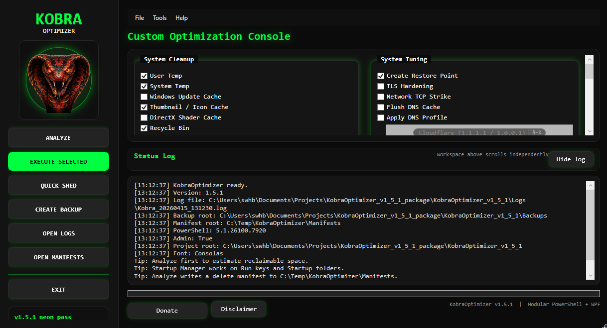
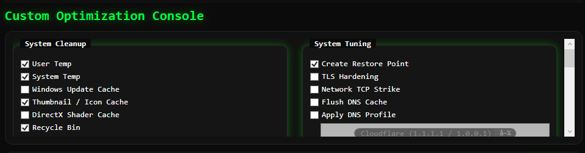
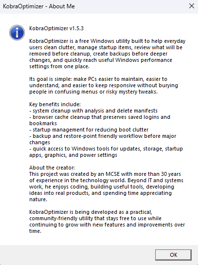

🐍 KobraOptimizer v1.5.1
A lightweight, modular PowerShell-based optimization tool designed to clean, tune, and streamline Windows systems with a simple, intuitive UI.

▶️ Launching KobraOptimizer
You can start the tool in two ways:

Option 1 — Run the PowerShell script
Right‑click Main.ps1 → Run with PowerShell

Option 2 — Easiest method (Recommended)
Use the included launcher:

Code
Launch_Kobra.cmd
Right‑click → Run as Administrator

This automatically starts the optimizer without requiring users to touch PowerShell settings.

🖼️ Logo
Place your logo file inside the repo (e.g., Assets/logo.png) and reference it like this:

Code

🚀 Features
✔ One‑click system cleanup

✔ Modular design (easy to add/remove modules)

✔ Simple and clean UI

✔ Logging system for debugging

✔ About window with version info

✔ Screenshot gallery included

📸 Screenshots
Main Window
Code

Cleanup Module
Code

About Window
Code

📦 Installation
Download the latest release from the Releases tab

Extract the ZIP

Run Main.ps1

Enjoy a cleaner, faster system

🛠️ Requirements
Windows 10 or 11

PowerShell 5.1+

Execution policy allowing script execution
(Run PowerShell as admin → Set-ExecutionPolicy RemoteSigned)

🧩 Project Structure
Code
KobraOptimizer/
│
├── Assets/              # Images, icons, logos
├── Logs/                # Runtime logs (ignored by Git)
├── Modules/             # Optimization modules
├── Screenshots/         # UI screenshots
├── Kobra_UI.xaml        # UI layout
├── Main.ps1             # Main application logic
└── README.md            # Documentation
📝 Changelog
v1.5.1
Added About window

Added screenshots

Cleaned up UI

Added .gitignore to protect logs

Repo structure improvements

🤝 Contributing
Pull requests are welcome.
For major changes, please open an issue first to discuss what you’d like to change.

📄 License
MIT License — see LICENSE for details.

## 📣 Credits

Created by **KobraOptimizer**  
Built with PowerShell, WPF, and a lot of neon.
